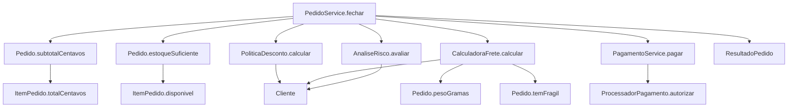
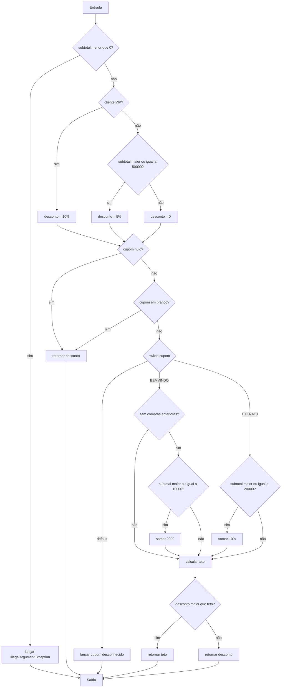
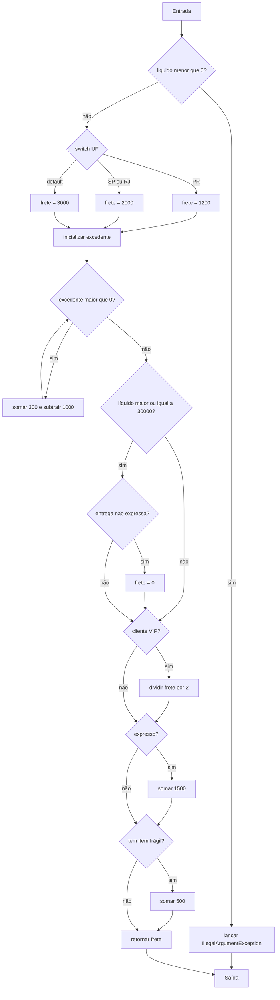
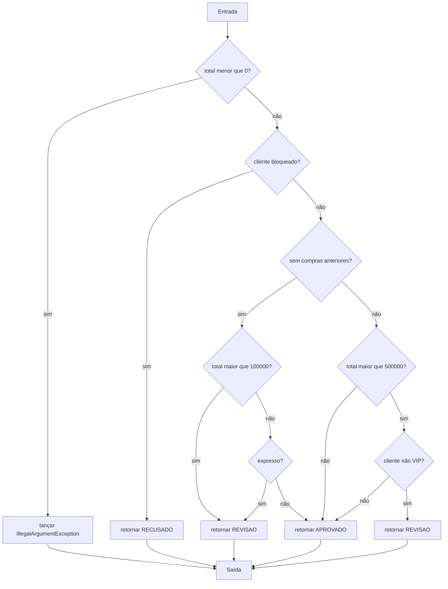
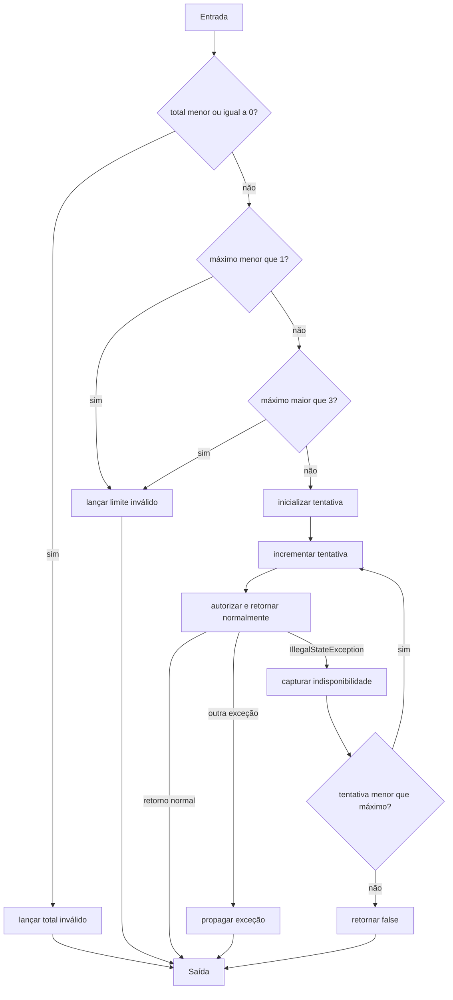
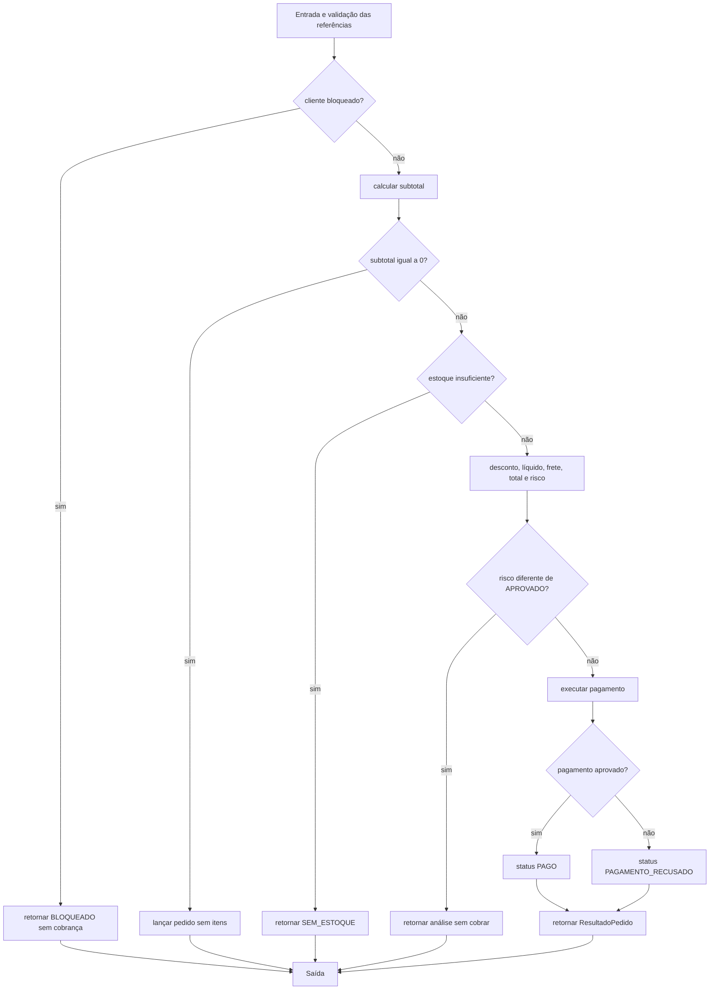

# Relatório — Central de pedidos

Integrante: Gabriel

## Modelo adotado

Os CFGs são intraprocedurais e agrupam instruções sequenciais em blocos básicos. Cada operando de `&&` e `||` é tratado como uma decisão separada, porque o curto-circuito pode impedir a avaliação do operando direito. Os `switch` possuem uma aresta para cada destino distinto. Todos os retornos e lançamentos explícitos convergem para uma saída sintética.

Exceções propagadas por métodos chamados não são expandidas no CFG do chamador. A exceção é expandida somente em `PagamentoService.pagar`, onde o próprio método contém `try/catch`: a autorização tem saída normal, `IllegalStateException` capturada e outra exceção propagada. Com um único componente conectado, foi usada a fórmula `V(G) = E - N + 2`.

## Relacionamento e grafo de chamadas

`PedidoService` coordena as regras sem persistência. `Pedido` agrega os itens e calcula informações derivadas. `ProcessadorPagamento` é a única dependência externa e foi substituído por lambdas ou stubs com estado nos testes.

## CFG — `PoliticaDesconto.calcular`

## CFG — `CalculadoraFrete.calcular`

## CFG — `AnaliseRisco.avaliar`

## CFG — `PagamentoService.pagar`

## CFG — `PedidoService.fechar`

## Complexidade de McCabe

| Método | Nós | Arestas | V(G) | Caminhos independentes | Restrições de viabilidade |
| --- | ---: | ---: | ---: | ---: | --- |
| `PoliticaDesconto.calcular` | 23 | 33 | 12 | 12 | O teto só é alcançado com cupom não vazio; cupom desconhecido termina antes do teto. |
| `CalculadoraFrete.calcular` | 21 | 29 | 10 | 10 | Gratuidade exige entrega normal, portanto gratuidade e expresso não podem ocorrer juntos. |
| `AnaliseRisco.avaliar` | 14 | 20 | 8 | 8 | A regra de R$ 5.000 só é avaliada quando há compras anteriores. |
| `PagamentoService.pagar` | 14 | 19 | 7 | 7 | `false` encerra imediatamente; somente `IllegalStateException` chega à decisão de repetir. |
| `PedidoService.fechar` | 17 | 21 | 6 | 6 | `RECUSADO` de risco é inviável pelo serviço, pois cliente bloqueado retorna antes como `BLOQUEADO`. |

### Base representativa de caminhos

- Desconto: subtotal negativo; VIP sem cupom; comum no limite de R$ 500; comum abaixo do limite; `BEMVINDO` elegível; `BEMVINDO` com histórico; `BEMVINDO` abaixo de R$ 100; `EXTRA10` elegível; `EXTRA10` inelegível; cupom desconhecido; desconto acima do teto; desconto igual ou abaixo do teto.
- Frete: líquido negativo; PR; SP/RJ; UF padrão; laço com zero, uma e várias iterações; gratuidade; VIP; expresso; item frágil. As combinações foram escolhidas para introduzir pelo menos uma aresta nova em cada caminho.
- Risco: total negativo; bloqueado; cliente novo acima de R$ 1.000; novo expresso; novo aprovado; recorrente comum acima de R$ 5.000; recorrente VIP acima do limite; recorrente no limite.
- Pagamento: total inválido; limite abaixo de 1; limite acima de 3; aprovação; recusa; indisponibilidade seguida de sucesso; indisponibilidade até esgotar; exceção diferente propagada.
- Fechamento: bloqueado; subtotal zero; falta de estoque; revisão; pagamento aprovado; pagamento recusado. Exceções de cupom e referências nulas também foram testadas, embora não acrescentem decisões explícitas ao CFG modular adotado.

## Matriz de testes

| ID / método JUnit | Unidade | Entrada e estado do stub | Resultado esperado | Caminho / aresta | Critério atendido |
| --- | --- | --- | --- | --- | --- |
| T01 `ClienteTest.*` | `Cliente` | Histórico 3, zero e -1 | Construção válida ou `IllegalArgumentException` | Validação falsa/verdadeira | Limites e exceção |
| T02 `deveCalcularTotalEInformarEstoqueDisponivel` | `ItemPedido` | 3 unidades e estoque 3 | Total 7500 e disponível | `quantidade <= estoque` verdadeiro | Método e ramo |
| T03 `deveInformarFaltaDeEstoque` | `ItemPedido` | 4 unidades e estoque 3 | Indisponível | `quantidade <= estoque` falso | Ramo |
| T04 testes `deveRejeitar*` | `ItemPedido` | Nulo, branco, abaixo/acima dos limites | `IllegalArgumentException` | Operandos esquerdo/direito dos `||` | Curto-circuito e limites |
| T05 `deveCalcularSubtotalEPesoIgnorandoItemInativo` | `Pedido` | Item ativo e item com quantidade zero | Subtotal 3000 e peso 600 | `continue`; várias iterações | Laço e item inativo |
| T06 `deveRetornarValoresNeutrosParaListaVazia` | `Pedido` | Lista vazia | 0, 0, sem frágil, estoque suficiente | Zero iterações | Limite do laço |
| T07 testes de fragilidade | `Pedido` | Frágil inativo, comum e frágil ativo | `false` ou `true` | Ambos operandos de `&&`; retorno antecipado | Branches e curto-circuito |
| T08 testes de estoque | `Pedido` | Falta no início/fim e todos disponíveis | `false`/`true` | `break`; uma/várias iterações | Laço e retorno |
| T09 testes de construção de `Pedido` | `Pedido` | Lista nula, 101 linhas, elemento nulo, UF inválida | Exceções esperadas | Validações e `List.copyOf` | Limites e exceções |
| T10 testes de desconto base | `PoliticaDesconto` | VIP, comum em 50000 e comum em 49999 | 10%, 5% e 0 | Três ramos da política base | Branches |
| T11 testes `BEMVINDO` | `PoliticaDesconto` | Novo elegível, recorrente, subtotal 9999 | 2000, 0, 0 | Ambos operandos do `&&` | Curto-circuito e limites |
| T12 testes `EXTRA10` | `PoliticaDesconto` | Subtotais 20000 e 19999 | 2000 e 0 | Limite igual/abaixo | Branches e fronteira |
| T13 teto, truncamento e cupom inválido | `PoliticaDesconto` | VIP novo, 10001, cupom desconhecido | Teto 20%, truncamento, exceção | Ternário verdadeiro/falso e default | Branches e exceção |
| T14 `deveAplicarTarifaBaseDaUf` | `CalculadoraFrete` | PR, SP, RJ e SC | 1200, 2000, 2000, 3000 | Cases e default | `switch` |
| T15 `deveCobrarPesoExcedentePorQuiloOuFracao` | `CalculadoraFrete` | 2000, 2001, 3000 e 3001 g | 1200, 1500, 1500, 1800 | Zero, uma e duas iterações | `while` e fronteiras |
| T16 testes de gratuidade, VIP, expresso e frágil | `CalculadoraFrete` | Combinações independentes | Valores exatos de frete | Verdadeiro/falso de cada decisão | Branches e combinações |
| T17 `AnaliseRiscoTest.*` | `AnaliseRisco` | Bloqueio, histórico, limites e expresso | `RECUSADO`, `REVISAO`, `APROVADO` | Oito caminhos básicos | Ramos e curto-circuito |
| T18 validações de `PagamentoServiceTest` | `PagamentoService` | Total 0; tentativas 0 e 4; processador nulo | Exceções esperadas | Validações verdadeira/falsa | Limites e exceções |
| T19 aprovação e recusa imediatas | `PagamentoService` | Stub retorna `true` ou `false` | Uma chamada e mesmo total | Retorno normal | Efeito observável |
| T20 sucesso após indisponibilidade | `PagamentoService` | Primeira chamada lança; segunda aprova | `true`, duas chamadas | `catch` e repetição | `try/catch` e estado |
| T21 `deveRetornarFalsoAoEsgotarTentativas` | `PagamentoService` | Stub sempre lança; limites 1, 2 e 3 | `false` e número exato de chamadas | Uma/várias iterações | `do/while` |
| T22 propagação de outra exceção | `PagamentoService` | `UnsupportedOperationException` | Exceção propagada | Aresta excepcional não capturada | Exceção |
| T23 teste inicial de fechamento | `PedidoService` | Comum, PR, normal, pagamento aprovado | `PAGO`, total 11200, uma cobrança | Caminho completo aprovado | Colaboração |
| T24 referências e processador nulos | `PedidoService` | Argumentos obrigatórios nulos | `NullPointerException` | Validação inicial | Exceções |
| T25 bloqueio | `PedidoService` | Bloqueado, sem estoque e cupom inválido | `BLOQUEADO`, zeros, sem cobrança | Primeiro retorno antecipado | Ordem do contrato |
| T26 subtotal zero | `PedidoService` | Somente item inativo | `IllegalArgumentException`, sem cobrança | Segundo retorno antecipado | Ordem e exceção |
| T27 falta de estoque | `PedidoService` | Quantidade maior que estoque e cupom inválido | `SEM_ESTOQUE`, zeros, sem cobrança | Terceiro retorno antecipado | Ordem do contrato |
| T28 revisão | `PedidoService` | Cliente novo e entrega expressa | `REVISAO`, valores calculados, sem cobrança | Risco não aprovado | Colaboração |
| T29 recusa e esgotamento | `PedidoService` | Stub retorna `false` ou lança 3 vezes | `PAGAMENTO_RECUSADO` | Ternário falso; repetição | Resultado e efeito |
| T30 integração VIP | `PedidoService` | VIP, `EXTRA10`, pagamento aprovado | Desconto 4000, frete 600, total 16600 | Ternário verdadeiro | Colaboração |
| T31 cupom inválido | `PedidoService` | Estoque válido e cupom desconhecido | Exceção e nenhuma cobrança | Interrupção antes do pagamento | Exceção e ordem |

## Evolução da cobertura

| Etapa | Testes executados | Linhas | Branches | Métodos | Classes | Lacunas e justificativas |
| --- | ---: | ---: | ---: | ---: | ---: | --- |
| Exemplo inicial | 1 | 80,56% | 43,10% | 95,24% | 100% | Um caminho chama todas as classes, mas deixa a maioria das alternativas sem exercício. |
| Testes unitários sem `PedidoServiceTest` | 73 | 78,70% | 91,38% | 80,95% | 77,78% | Boa cobertura das unidades; `PedidoService` e `ResultadoPedido` ficam fora desta execução, por isso linhas/classes caem em relação ao exemplo. |
| Suíte final | 85 | 100% | 100% | 100% | 100% | Todas as 108 linhas, 116 branches, 21 métodos e 9 classes concretas foram cobertos. |

O relatório final também registra 637 instruções e complexidade coberta 80, sem itens perdidos. Os percentuais foram lidos de `target/site/jacoco/jacoco.xml` após cada execução controlada.

## Análise crítica

### Ramos não equivalem a caminhos completos

Em `CalculadoraFrete`, um teste com todos os booleanos falsos e outro com todos verdadeiros pode cobrir os dois resultados de várias decisões, mas não cobre todas as combinações entre gratuidade, VIP, expresso e fragilidade. Além disso, gratuidade e expresso são incompatíveis: a gratuidade exige `!pedido.expresso()`. Os testes foram separados para demonstrar combinações relevantes, sem alegar enumeração exaustiva.

### Curto-circuito

Foram criados casos em que o operando direito é executado e casos em que é pulado. Exemplos: SKU nulo impede `isBlank`; cupom nulo impede `isBlank`; cliente com compras anteriores impede a avaliação do subtotal no `BEMVINDO`; total acima de R$ 1.000 impede a avaliação de `expresso`; valor líquido abaixo de R$ 300 impede a avaliação de `!expresso`.

### Caminho inviável pelo serviço

`AnaliseRisco.avaliar` pode retornar `RECUSADO` para cliente bloqueado e esse caminho foi testado diretamente. Ele não pode ser observado através de `PedidoService.fechar`, pois o serviço devolve `BLOQUEADO` antes de calcular subtotal, estoque, desconto, frete ou risco.

### Laços e exceções

Os `for` de `Pedido` foram exercitados com zero, uma e várias iterações, além de `continue` e `break` no início e no fim. O `while` do frete foi exercitado com zero, uma e duas iterações, incluindo quilo exato e fração. O `do/while` de pagamento foi exercitado com limites de 1, 2 e 3 tentativas. Foram testadas exceções de validação, cupom desconhecido, processador nulo, indisponibilidade capturada e exceção não capturada. O JaCoCo não contabiliza o tratamento de exceção como branch, mas as asserções comprovam esses comportamentos.

### Alteração proposital

A taxa VIP foi alterada temporariamente de 10% para 11%. O teste `PoliticaDescontoTest.deveAplicarDezPorCentoParaVip` falhou com `esperado: 1000; obtido: 1100`, demonstrando que a asserção detecta a mudança da regra. A implementação foi restaurada para 10% e a suíte completa voltou a passar com 85 testes e 100% de cobertura.
